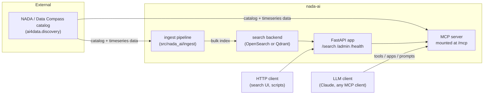
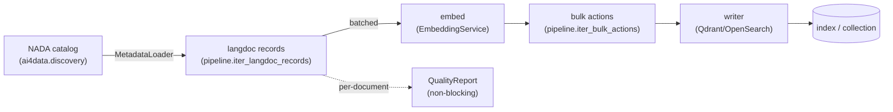

# nada-ai developer guide

A complete reference for `nada-ai`: what it is, how the semantic search stack and the
MCP server work, how they connect to NADA, and how to configure, run, and deploy the
whole thing.

This guide is the long-form companion to the [README](../README.md). If you just want
to get a local stack running, jump to [Quickstart](#quickstart). If you're integrating
an LLM agent, jump to [The MCP server](#the-mcp-server).

## Contents

- [What this repo is](#what-this-repo-is)
- [Architecture at a glance](#architecture-at-a-glance)
- [Quickstart](#quickstart)
- [Connecting to NADA](#connecting-to-nada)
- [Semantic search](#semantic-search)
  - [Search backends: OpenSearch vs Qdrant](#search-backends-opensearch-vs-qdrant)
  - [Embeddings](#embeddings)
  - [Search modes: keyword, vector, hybrid](#search-modes-keyword-vector-hybrid)
  - [Dynamic filters and facets](#dynamic-filters-and-facets)
  - [The REST search API](#the-rest-search-api)
- [Ingestion](#ingestion)
  - [How a document gets indexed](#how-a-document-gets-indexed)
  - [Running ingestion](#running-ingestion)
  - [Ingest quality reports](#ingest-quality-reports)
  - [Embedding drift detection](#embedding-drift-detection)
- [The MCP server](#the-mcp-server)
  - [Tools](#tools)
  - [Interactive apps](#interactive-apps)
  - [Resources and prompts](#resources-and-prompts)
  - [Security: prompt-injection defense](#security-prompt-injection-defense)
  - [Running the MCP server](#running-the-mcp-server)
- [Admin API: auth, RBAC, audit, rate limiting](#admin-api-auth-rbac-audit-rate-limiting)
- [Configuration reference](#configuration-reference)
- [Deployment](#deployment)
- [Observability](#observability)
- [Testing](#testing)
- [Repository layout](#repository-layout)

---

## What this repo is

`nada-ai` ingests metadata from **NADA** (National Data Archive) catalogs — the
[Data Compass](https://data-compass.ihsn.org/)-style microdata/timeseries cataloging
system used by IHSN and partner statistical agencies — and exposes two ways to work
with that catalog. Nothing in the codebase is hardcoded to IHSN's own deployment:
every catalog/instance-specific value (base URL, credentials, extract path) is
configuration, so `nada-ai` works against any NADA instance — IHSN's Data Compass is
just the reference instance used in examples throughout this guide.

1. **Semantic search** — a FastAPI service that indexes catalog metadata into a vector
   store (OpenSearch or Qdrant) and serves keyword / vector / hybrid search over it,
   with dynamic facet filtering, recommendations, and admin tooling for ingest and
   index management.
2. **MCP server** — a [Model Context Protocol](https://modelcontextprotocol.io) server
   that exposes catalog search and timeseries analytics as tools, interactive UI apps,
   resources, and prompts, so an LLM agent (Claude, or any MCP client) can search the
   catalog and analyze indicator data conversationally.

Both surfaces are served by the **same process** — `uvicorn nada_ai.app.main:app`
mounts the MCP server at `/mcp` alongside the REST search API.



---

## Architecture at a glance

| Layer | Where | Purpose |
|---|---|---|
| **Catalog client** | `src/nada_ai/nada/` | Typed httpx client for NADA's search, metadata, and timeseries APIs |
| **Discovery** | external `ai4data.discovery` package | Catalog auth, caching, bulk metadata extraction — the only import boundary allowed for talking to `ai4data` (enforced by `tests/test_ai4data_import_boundary.py`) |
| **Ingest** | `src/nada_ai/ingest/` | Pulls catalog metadata, computes embeddings, bulk-writes to the search backend |
| **Search** | `src/nada_ai/search/` | Backend-agnostic search contract + OpenSearch/Qdrant implementations |
| **Filters** | `src/nada_ai/filters/` | Syncs facet filters from a NADA instance's metadata-extract API into the index |
| **FastAPI app** | `src/nada_ai/app/` | `/search`, `/recommendations`, `/admin/*`, `/health*`, mounts MCP at `/mcp` |
| **MCP server** | `src/nada_ai/mcp_server/` | Tools, interactive apps, resources, prompts for LLM agents |

---

## Quickstart

**Requirements**: Python 3.11+, [uv](https://docs.astral.sh/uv/), Docker (for the
vector store), and network access to a NADA catalog (defaults to the public Data
Compass instance if you don't set one — see below).

```bash
git clone <this repo> && cd nada-ai
cp .env.example .env
uv sync --extra local --extra qdrant
```

> **macOS + Docker Desktop**: the `docker` CLI lives at `~/.docker/bin/docker` and is
> only on `PATH` in a login shell. If `docker: command not found` in a non-login shell
> (some editor/task-runner terminals), run `export PATH="$HOME/.docker/bin:$PATH"`
> first, or open a login shell (`zsh -l`).

**Point at a specific NADA instance (optional — skip to use the public default):** set
`AI4DATA_METADATA_CATALOG_URL` in `.env` to your target instance's base URL (e.g.
`https://your-nada-instance/index.php`). Left unset, `ai4data` defaults to its own
bundled Data Compass URL, which is a fine way to try things out but is not
necessarily the catalog you actually want.

> **Set an admin credential for your NADA instance if you have one.** `.env.example`
> enables NADA's bulk `search-metadata-extract` API by default
> (`AI4DATA_METADATA_CATALOG_EXTRACT_PATH`) — a full-catalog `index_from_catalog` run
> does ~N/100 HTTP calls instead of ~N, and filter/facet sync comes along for free on
> the same fetch (see [Ingestion](#ingestion)). This endpoint is admin-only, so set
> `AI4DATA_METADATA_CATALOG_X_API_KEY` (or `_AUTH_BEARER`/`_COOKIES`) in `.env` to an
> admin-capable credential for your target NADA instance. No admin credential
> available? Comment out `AI4DATA_METADATA_CATALOG_EXTRACT_PATH` in `.env` and nada-ai
> falls back to the classic per-idno flow automatically — no other change needed.

Bring up a local Qdrant + API stack (recommended local path — see the
[Qdrant pipeline guide](qdrant-pipeline-guide.md) for the fully worked walkthrough,
including a host-only ingest path that skips Docker for the API):

```bash
docker compose -f docker-compose.qdrant.yml -f docker-compose.dev.yml up --build -d
```

Create the index/collection and pull the catalog in:

```bash
uv run python -m nada_ai.ingest.cli create_index
uv run python -m nada_ai.ingest.cli index_from_catalog
```

Search it:

```bash
curl -s localhost:8020/search -H 'content-type: application/json' \
  -d '{"query": "poverty headcount ratio", "mode": "hybrid", "size": 5}' | jq
```

Or open [http://localhost:8020/demo](http://localhost:8020/demo) in a browser — a
minimal built-in UI over the same `/search` endpoint (see
[The REST search API](#the-rest-search-api)), no curl required.

Point an MCP client at `http://localhost:8020/mcp` (streamable HTTP), or run the
standalone MCP server:

```bash
uv run python -m nada_ai.mcp_server --port 8025
```

Prefer OpenSearch instead of Qdrant (the default)? Same shape, different compose file
and one setting:

```bash
docker compose -f docker-compose.opensearch.yml -f docker-compose.dev.yml up --build -d
```

with `NADA_SEARCH_BACKEND=opensearch` in `.env`.

---

## Connecting to NADA

`nada-ai` talks to NADA through two layers, and it's worth knowing which one owns
which credential:

1. **`ai4data.discovery`** (pinned git dependency, see `[tool.uv.sources]` in
   `pyproject.toml`) does the heavy lifting for *ingestion*: catalog auth headers/
   cookies, on-disk caching under `AI4DATA_DISCOVERY_DATA_PATH`, and bulk
   `search-metadata-extract/studies` fetching. `nada-ai`'s own code may only import
   `ai4data.discovery.*` — this is enforced by a dedicated test
   (`tests/test_ai4data_import_boundary.py`), not just convention.
2. **`src/nada_ai/nada/api.py`** is a thin typed httpx client used directly by the app
   and MCP layers for *read* access beyond ingestion:

   | Function | Endpoint | Used by |
   |---|---|---|
   | `search_catalog()` | `GET {AI4DATA_METADATA_CATALOG_URL}/api/catalog/search` | `nada_search_catalog` MCP tool, search app |
   | `get_metadata(idno)` | `GET .../api/catalog/{idno}` | `nada_get_metadata` MCP tool |
   | `get_timeseries_data(idno, ...)` | `GET .../api/timeseries/data/{idno}` | `nada_get_data`, all analytics tools |
   | `get_indicator_schema(idno)` | `GET .../api/timeseries/data/{idno}/schema` | `nada_get_schema`, all analytics tools (schema-first workflow) |
   | `get_codelist(idno, component)` | derived by sampling data (no dedicated endpoint) | `nada_get_codelist` |
   | `get_all_timeseries_data(idno, ...)` | auto-paginating wrapper over the data endpoint | analytics tools that need the full series |

**Auth**: the public Data Compass instance needs no credentials. A gated catalog
accepts `AI4DATA_METADATA_CATALOG_X_API_KEY` (`x-api-key` header), an auth cookie
(`AI4DATA_METADATA_CATALOG_COOKIES`), or a bearer token
(`AI4DATA_METADATA_CATALOG_AUTH_BEARER`) — this is the **one** outbound credential set
for the whole package: content ingest, `nada_ai.filters` (facet sync), and
`nada_ai.ingest.search_index_sync` (queue reconciliation) all use it automatically,
with no separate per-feature credential to configure (see
`src/nada_ai/nada/admin_auth.py`). Only the request **URLs** for the latter two are
independently overridable (`NADA_METADATA_EXTRACT_BASE_URL`,
`NADA_SEARCH_INDEX_BASE_URL`, both optional, both derived from
`AI4DATA_METADATA_CATALOG_URL` when unset) — for the rare case where those admin
surfaces live at a different host/path than the derivation produces.

> **Trust boundary — don't cross it.** `NADA_ADMIN_API_KEY` is *inbound*: it's what
> callers present to authenticate to *this* service. `AI4DATA_METADATA_CATALOG_X_API_KEY`
> is *outbound*: what this service presents to the configured NADA instance. Never
> reuse one value for both — leaking one should never grant the other.

To point at a different NADA instance, set `AI4DATA_METADATA_CATALOG_URL`.
`.env.example` enables the bulk `search-metadata-extract` endpoint
(`AI4DATA_METADATA_CATALOG_EXTRACT_PATH`) by default — substantially faster for large
catalogs than the classic search + per-idno JSON flow — but it's admin-only, so it
needs an admin-capable credential for the target instance (see
[Quickstart](#quickstart)). Comment the setting out to fall back to the classic flow
against an instance where you only have anonymous/read access.

---

## Semantic search

### Search backends: OpenSearch vs Qdrant

`NADA_SEARCH_BACKEND` picks the implementation; everything else (the REST API, the
MCP search tool, the ingest pipeline) is written against a single backend-agnostic
contract (`src/nada_ai/search/ports.py::SearchBackendPort`) so the choice is purely
operational.

| | Qdrant (default) | OpenSearch |
|---|---|---|
| Vector search | native HNSW | k-NN plugin |
| Keyword leg | FastEmbed BM25 sparse vectors (`NADA_QDRANT_SPARSE_LEXICAL`) | BM25 (native) |
| Hybrid fusion | RRF (reciprocal rank fusion) with collapse-group prefetch | weighted score combination |
| Server-side embeddings | not supported — always client-side | optional, via ML Commons (`opensearch_ml` backend) |
| Best for | simpler local dev loop, native sparse+dense hybrid | teams already standardized on OpenSearch/Elasticsearch tooling |

Both are covered end-to-end, including Docker Compose setups, in the
[Qdrant pipeline guide](qdrant-pipeline-guide.md).

### Embeddings

`NADA_EMBEDDING_BACKEND` selects how vectors are produced:

- **`local`** (default) — a `sentence-transformers` model
  (`NADA_EMBEDDING_MODEL_ID`, default `microsoft/harrier-oss-v1-270m`) runs in-process.
  Works with either search backend.
- **`opensearch_ml`** — OpenSearch ML Commons computes embeddings server-side via an
  ingest pipeline (`NADA_OPENSEARCH_ML_INGEST_PIPELINE_NAME`). OpenSearch-only;
  requires a deployed model (`NADA_OPENSEARCH_ML_MODEL_ID`) and its output dimension
  (`NADA_OPENSEARCH_ML_EMBEDDING_DIMENSION`) to match the index mapping exactly.

Query encoding is **asymmetric**: `NADA_QUERY_PROMPT_NAME` (or a literal
`NADA_QUERY_PROMPT`, which overrides the name) prefixes queries differently from how
documents were encoded, which is standard practice for retrieval-tuned embedding
models. Get this wrong and search quality silently degrades — there's no error, just
worse rankings.

### Search modes: keyword, vector, hybrid

`POST /search` accepts `mode: "keyword" | "vector" | "hybrid"`.

- **keyword** — classic BM25 over `page_content` and metadata text fields.
- **vector** — k-NN / HNSW nearest-neighbor over the query embedding.
- **hybrid** — both legs combined. Weights are `NADA_HYBRID_KEYWORD_BOOST` (default
  `0.3`) and `NADA_HYBRID_VECTOR_BOOST` (default `0.7`). On Qdrant, hybrid also mixes
  in the BM25 sparse leg when `NADA_QDRANT_SPARSE_LEXICAL` is enabled.

A fast path (`src/nada_ai/search/query_heuristics.py::looks_like_catalog_idno`)
detects idno-shaped queries (e.g. `WLD_2021_ABC-123_v01_M`) and short-circuits to an
exact lookup rather than running full search.

### Dynamic filters and facets

External catalog filters (country, topic, data class, etc.) are synced from a NADA
instance's metadata-extract API into the index under `metadata.filter_fields` — see
[`docs/dynamic-filters.md`](dynamic-filters.md) for the full sync/query story. In short:

- **Qdrant** stores both the nested `metadata.filter_fields` array (parity/backfill
  source of truth) *and* a flattened `metadata.filter_facets` map with payload indexes
  per facetable key, for fast filter+facet aggregation queries.
- **OpenSearch** keeps only the nested `metadata.filter_fields` form.
- The registry of which keys are facetable is **auto-derived**, not manually curated:
  every filter sync (including content ingest, see below) auto-registers and indexes
  any key NADA sends that isn't already known — `config/dynamic_filter_facets.json`
  (path overridable via `NADA_DYNAMIC_FILTER_FACETS_PATH`) is a cache of what's been
  seen, not a policy file you edit by hand. `GET/PUT/POST/DELETE /admin/facets` still
  works, but mainly as an **exclusion** mechanism — `DELETE` suppresses a key so
  auto-registration won't resurrect it, `POST`/`PUT` always wins over a prior exclusion.
- Content ingest (`index_from_catalog`, `index`, and the search-index queue
  reconciliation) **also syncs filters/facets in the same pass** — no separate step
  required. `nada_ai.filters.cli {sync, sync-batch, sync-from-extract, backfill-facets}`
  remain available for a standalone filters-only pass (e.g. re-syncing filters without
  touching embeddings) or for backends where `sync_filters_during_ingest` was disabled.
  Disable the automatic behavior with `NADA_SYNC_FILTERS_DURING_INGEST=false` if you
  want pure content-only ingest (shaves one metadata-extract round trip per idno).

### The REST search API

| Route | Purpose |
|---|---|
| `POST /search` | Keyword/vector/hybrid search with filters, facets, pagination |
| `POST /recommendations` | "More like this" via chunk-embedding fusion (`search/vector_fusion.py`) |
| `POST /search/explain` | Non-LLM explanation of why a result matched a filter (`search/explain_filters.py`) |
| `GET /health`, `/ready` | Liveness/readiness, including MCP dependency probing when `NADA_MCP_READINESS_ENABLED=true` |
| `GET /demo` | Minimal built-in browser UI that posts to `POST /search` — a query box, mode/filter controls, and results tabbed by data type. The fastest way to sanity-check a fresh ingest without writing curl — open it right after `index_from_catalog` completes. |

Admin/ingest/catalog-management routes are covered in
[Admin API](#admin-api-auth-rbac-audit-rate-limiting). A CLI equivalent of a live search — `python -m nada_ai.demo_integration --max_items=5` — runs a small live catalog + search walkthrough directly in the terminal, useful for a quick end-to-end check without the browser.

**Single-word queries and the idno fast path**: `/search` has a heuristic (`search/query_heuristics.py::looks_like_catalog_idno`) that fast-paths compact, space-free queries (`WDI_SP.POP.TOTL`, but also any plain single word like `poverty`) straight to an exact idno lookup, skipping full search for the common case of pasting an idno into the box. If that exact-match lookup finds nothing — the overwhelmingly common outcome for a real single-word search term, since most single words aren't idnos — the app falls back to running real search once more automatically, so this is transparent from the API/UI side; it only costs one extra round trip on the miss case, never a wrong "no results."

---

## Ingestion

### How a document gets indexed



1. `src/nada_ai/ingest/pipeline.py::iter_langdoc_records` loads catalog metadata
   through `ai4data`'s `MetadataLoader` and converts each study into a "langdoc"
   (the canonical document shape defined in `search/documents.py`).
2. It also fetches, normalizes, and auto-registers that idno's filters/facets
   (`nada_ai.filters.sync.fetch_filters_for_idno`) and bakes them into the same
   document — see [Dynamic filters and facets](#dynamic-filters-and-facets). No
   separate filters-sync pass is needed after a content ingest.
3. Embeddings are computed in batches (`buffer_size`) to bound memory.
4. `iter_bulk_actions` builds backend-specific bulk write actions; `run_bulk_index`
   executes them via whichever writer `create_ingest_writer()` (`ingest/factory.py`)
   selects for the configured `NADA_SEARCH_BACKEND`.
5. Every document is passed through `ingest/quality.py::check_source_document` along
   the way — see [Ingest quality reports](#ingest-quality-reports).

**Performance**: how expensive step 1 is depends on
`AI4DATA_METADATA_CATALOG_EXTRACT_PATH`. Enabled (the `.env.example` default) —
`get_metadata_ids` paginates NADA's bulk `search-metadata-extract/studies` endpoint
once, warming the local metadata cache (including filters) for every idno on each
page; the later per-idno `MetadataLoader` fetch is then a cache hit, not a second
network call. Disabled — every idno gets its own `/api/catalog/json/{idno}` call, an
N+1 pattern. The bulk endpoint is admin-only (requires
`AI4DATA_METADATA_CATALOG_X_API_KEY`/`_AUTH_BEARER`/`_COOKIES` for an admin-capable
account on the target instance); comment the setting out to fall back to the classic
flow, which works against a public/anonymous-read catalog.

### Running ingestion

Two equivalent entry points share the same underlying operations
(`ingest/service.py`'s `*_op` callables) so CLI and HTTP behavior never drift apart —
with one exception noted below (`POST /admin/ingest/from-catalog/all` is HTTP-only,
a thin loop over the single-type operation, not a new op of its own):

**CLI** (`python -m nada_ai.ingest.cli ...`):

```bash
uv run python -m nada_ai.ingest.cli create_index
uv run python -m nada_ai.ingest.cli put_index_template   # OpenSearch only
uv run python -m nada_ai.ingest.cli index_from_catalog    # pull + index ONE catalog_type (default: timeseries)
uv run python -m nada_ai.ingest.cli index                 # index pre-fetched records
uv run python -m nada_ai.ingest.cli index_ids --idnos idno1,idno2   # targeted re-index
uv run python -m nada_ai.ingest.cli setup_ingest_pipeline  # OpenSearch ML Commons only
```

**HTTP admin API** (`src/nada_ai/app/admin.py`, `catalog_admin.py`) — the same
operations as background jobs, for triggering ingestion without shell access:

```bash
# Pull + index ONE catalog type (role: write) — works with either search
# backend, Qdrant or OpenSearch. catalog_type defaults to "timeseries";
# accepts timeseries | indicator | survey | microdata | document | geospatial |
# timeseriesdb | indicator-db | table | script | image | video.
curl -X POST localhost:8020/admin/ingest/from-catalog \
  -H "X-NADA-Admin-Key: $NADA_ADMIN_API_KEY" -H 'content-type: application/json' \
  -d '{"catalog_type": "document"}'

# Pull + index EVERY catalog type in one call (role: write) — submits one
# job per type (document, timeseries, survey, geospatial, timeseriesdb, table,
# script, image, video), each still
# single-flighted on its own catalog_type, so calling this again while a
# type is still indexing reports that type's existing job instead of
# duplicating it. Pass "recreate_index": true to drop and rebuild the
# index/collection once, up front, before any type is indexed (not once per
# type — that would wipe out whichever type was indexed just before it).
curl -X POST localhost:8020/admin/ingest/from-catalog/all \
  -H "X-NADA-Admin-Key: $NADA_ADMIN_API_KEY" -H 'content-type: application/json' -d '{}'

# Targeted batch re-index by idno (role: write)
curl -X POST localhost:8020/admin/catalog/index \
  -H "X-NADA-Admin-Key: $NADA_ADMIN_API_KEY" -H 'content-type: application/json' \
  -d '{"idnos": ["idno1", "idno2"]}'
```

Jobs run through `JobRegistry` (`app/jobs.py`), which enforces single-flight semantics
per job type and honors `NADA_MAX_CONCURRENT_INGEST_JOBS` (default `1`) — ingestion is
CPU/memory-heavy (embedding compute), so concurrent full-catalog jobs are capped by
default. A `POST /webhooks/catalog` endpoint accepts catalog lifecycle events and
triggers targeted background reindex jobs, for push-based updates instead of polling.

### Ingest quality reports

Every ingested document is checked non-blockingly for shape problems — an empty or
suspiciously short `page_content`, a missing `idno`, or a missing type. Nothing is
ever rejected because of a quality issue; the report is purely observational,
attached to the ingest job result, and capped at `sample_limit` (default 20) sample
idnos per issue code so it stays small on large catalogs. Use it to spot upstream
catalog data problems without adding a blocking validation layer that could stall
ingestion on data you don't control.

### Progress, cancellation, and resuming a full-catalog ingest

`POST /admin/ingest/from-catalog` and `.../from-catalog/all` report live progress
and can be stopped and resumed instead of running as an opaque, unstoppable block:

- **Progress**: `GET /jobs/{id}` (and `GET /jobs`) includes a `progress` object —
  `{"processed", "total", "failed", "current_idno", "percent"}` — updated once per
  idno as the run goes, not just once at the end.
- **Stop**: `DELETE /jobs/{id}` (role `write`) sets a cancel token the ingest loop
  checks once per idno. Note the asymmetry this implies: the job's *status* flips
  to `cancelled` almost immediately (the wrapping coroutine really is cancelled),
  but the worker thread doing the actual embedding/writing keeps running until it
  next checks the token — `asyncio.to_thread` cannot forcibly kill a thread, so
  cancelling only *asks* the loop to stop at its next opportunity, one idno later.
- **Resume**: pass `"resume": true` in the request body. This loads a per-`catalog_type`
  checkpoint file (`NADA_INGEST_CHECKPOINT_DIR`, default `config/ingest_checkpoints/`)
  recording which idnos already completed, and skips them — so a stopped or crashed
  run continues instead of reindexing the whole catalog again. The checkpoint is
  cleared automatically once a run finishes without being cancelled; there's nothing
  to clean up by hand.
- **Per-idno failures**: the job result's `load_errors` list records idnos whose
  metadata itself failed to fetch/parse (previously only a server log line, with no
  record anywhere of which idno or why) — distinct from `errors` (write-time
  failures against the search backend) and `quality` (non-blocking content-shape
  observations, see above).

**Resource usage**: `NADA_EMBEDDING_NUM_THREADS` caps `torch.set_num_threads` for
the local embedding backend — unset (default), PyTorch uses every visible CPU
core, which is the single biggest cause of "reindexing pegs the whole machine."
Set it to leave headroom for anything else running alongside nada-ai.
`buffer_size` (per-request, default 200 — previously 1000) is unrelated to the
model's own inference batch size (`NADA_EMBEDDING_BATCH_SIZE`, default 32, applied
regardless); it only controls how many documents accumulate in memory before one
encode+write batch, which also sets how often progress/checkpoint updates happen —
smaller means more frequent updates and less lost work if a run is stopped, at a
small cost in per-call overhead.

**Dropping the index without reindexing**: previously the only way to delete a
Qdrant collection was bundled inside `recreate_index=True` on a full reindex call
(`DELETE /admin/index` only ever worked for OpenSearch, 501ing under
`NADA_SEARCH_BACKEND=qdrant`). `DELETE /admin/qdrant/collection?confirm=true`
(role `admin`) drops the collection on its own, with no reindex attached.

### Embedding drift detection

`GET /admin/embeddings/drift` (role `read`) compares the dimension of the currently
configured embedding model against what's actually stored in the index/collection
mapping. A mismatch means vector/hybrid search is already broken against existing
data. Both ingest writers also check this themselves before writing to an *existing*
index/collection (not just when creating a new one) and raise immediately if the
configured model's dimension doesn't match — so a changed `NADA_EMBEDDING_MODEL_ID`
fails fast at the start of an ingest run, not per-document deep inside a bulk write.
Check `/admin/embeddings/drift` after **any** embedding model change; the fix is
either reverting the model or re-ingesting with `recreate_index=True`/`recreate_target=True`
(a full reindex).

### Search-index queue reconciliation

Beyond the push-based `/webhooks/catalog` and manual admin/CLI reindex commands, nada-ai
can also *pull* changes from NADA's own `search-index` change queue (see
[Connecting to NADA](#connecting-to-nada) for the underlying API) — useful as a
catch-up path after downtime, or as the only sync mechanism when the target NADA
instance can't call out via webhook.

**One-shot / CLI** (`nada_ai.ingest.search_index_sync`):

```bash
uv run python -m nada_ai.ingest.cli search_index_status        # queue/state counts, tracking_enabled
uv run python -m nada_ai.ingest.cli reconcile_search_index --limit=50
```

This is a bare, `Settings`-only function with no access to the FastAPI job registry —
concurrent runs (e.g. cron alongside a live webhook) aren't coordinated with other
write paths for the same idno.

**In-process scheduler** (recommended when running the FastAPI app): set
`NADA_RECONCILE_SEARCH_INDEX_ENABLED=true` to run reconciliation as a periodic
background loop inside the app itself (`app/reconcile_scheduler.py`), started in the
app's lifespan and cancelled cleanly on shutdown. Each queue item is submitted as its
own job through the **same** `JobRegistry` and the **same** `content:{metadata_type}:{idno}`
key that `/webhooks/catalog` and the admin index/reindex routes use — so a
queue-driven reindex and a webhook-triggered one for the same idno now properly
single-flight against each other instead of racing with no coordination.

| Variable | Default | Purpose |
|---|---|---|
| `NADA_RECONCILE_SEARCH_INDEX_ENABLED` | `false` | Run the in-process reconciliation scheduler |
| `NADA_RECONCILE_SEARCH_INDEX_INTERVAL_SECONDS` | `300` | Seconds between polls |
| `NADA_RECONCILE_SEARCH_INDEX_BATCH_LIMIT` | `50` | Max queue items submitted as jobs per poll |

**Trigger a poll on demand over HTTP** (role: write) — runs the same logic as one
scheduler tick right now, instead of waiting for the next interval:

```bash
curl -X POST localhost:8020/admin/ingest/reconcile \
  -H "X-NADA-Admin-Key: $NADA_ADMIN_API_KEY"
# => {"polled": 3}
```

This submits each pending queue item as its own job (same `JobRegistry` path as the
scheduler) and returns immediately — it does not wait for those jobs to finish.
Poll `GET /jobs` to watch them complete. Safe to call whether or not the background
scheduler is enabled; single-flight on `content:{metadata_type}:{idno}` keeps it from
racing a concurrent scheduler tick, webhook, or admin reindex for the same idno.

**Check queue/tracking status over HTTP** (role: read) — the same data the
`search_index_status` CLI command prints, for a dashboard that can't shell out:

```bash
curl -s localhost:8020/admin/search-index/status \
  -H "X-NADA-Admin-Key: $NADA_ADMIN_API_KEY"
# => {"status": "ok", "search_provider": "nada-ai", "tracking_enabled": true,
#     "queue": {"pending": 2, "failed": 0}, "state": {"indexed": 100}}
```

Returns `400` if no search-index base URL is configured (`NADA_SEARCH_INDEX_BASE_URL`
or `AI4DATA_METADATA_CATALOG_URL`), `503` if NADA's status endpoint is unreachable.

Enabling the scheduler needs two things configured on NADA's side, not just here:
an admin-capable credential (`AI4DATA_METADATA_CATALOG_X_API_KEY` — the same one
everything else uses), and NADA's own `search_provider`/tracking configuration
actually pointed at this deployment — check with `search_index_status` first. If
`tracking_enabled` is `false`, the queue stays empty and the scheduler logs a warning
each poll rather than failing silently.

---

## The MCP server

The MCP server exposes catalog search and timeseries analytics for LLM agents via the
[Model Context Protocol](https://modelcontextprotocol.io): **tools** (function calls),
**interactive apps** (rich UI widgets a client can render), **resources** (static
reference documents), and **prompts** (user-invoked slash commands).

All tool names are prefixed by `NADA_MCP_TOOL_PREFIX` (default `nada`), and are
annotated `readOnlyHint: true, destructiveHint: false, idempotentHint: true,
openWorldHint: true` — every tool in this server only reads from the catalog, never
writes.

### Tools

The analytical tools follow a **schema-first workflow**: call `nada_get_schema`
before anything else, since every other analytical tool needs to know column names,
codelists, and the time format for the specific indicator being queried — schemas
vary per DSD (Data Structure Definition), so nothing here can be hardcoded.

| Tool | Purpose |
|---|---|
| `nada_search_catalog` | **Step 1.** Search the catalog by keywords + filters (type, year, country, topic, tag, region, data_class, ...) → returns `idno`s |
| `nada_get_metadata` | **Step 2.** Full metadata for one `idno` (definition, methodology, abstract) |
| `nada_get_schema` | DSD schema for a timeseries `idno` — column names/roles, codelists, time format, year bounds. **Prerequisite for every tool below.** |
| `nada_get_codelist` | Distinct code/label pairs for one DSD component |
| `nada_get_data` | **Step 3.** Paged raw observation rows |
| `nada_rank` | Top/bottom-N ref areas by value for a period |
| `nada_extremes` | Global max/min observation across all periods and ref areas |
| `nada_compare` | Pivoted time-series table across multiple ref areas |
| `nada_summarize` | Descriptive stats (min/max/mean/median/std) for a period |
| `nada_growth` | Period-over-period absolute/% change per ref area |
| `nada_correlate` | Pearson *r* between two indicators for a period |
| `nada_outliers` | Outlier detection — `modified_zscore` (MAD), `iqr` (Tukey fences), or `trend_residual` (LOWESS); cross-section or longitudinal mode |
| `nada_trend` | Linear regression (slope, R², direction) per ref area |
| `nada_benchmark` | Percentile rank / Z-score of specific ref areas vs. a peer group |
| `nada_coverage` | Data availability (periods, gaps, coverage %) per ref area |
| `nada_join` | Row-aligned merge of two indicators by `(ref_area, period)` |
| `nada_aggregate` | Group-level stats (mean/median/total/min/max/std) per period for a custom ref-area set |

### Interactive apps

Each analytical tool (plus search and schema exploration) also ships an **interactive
app** — a `FastMCPApp` UI that a compatible MCP client can render inline, with forms
and charts backed by the same analytics functions. Apps live in
`src/nada_ai/mcp_server/apps/`:

`search_app` · `schema_app` · `rank_app` · `extremes_app` · `compare_app` ·
`summarize_app` · `growth_app` · `correlate_app` · `outliers_app` · `trend_app` ·
`benchmark_app` · `coverage_app` · `join_app` · `aggregate_app` · `visualize_app`

Charts (`prefab_ui.components.charts`, rendered client-side with Recharts) are only
added where the chart's column set is **fixed regardless of input size** —
e.g. `aggregate_app`'s mean/median line, `coverage_app`'s coverage-% bar,
`correlate_app`'s scatter, and `visualize_app`'s 3 fixed indicator slots. Apps that
compare an arbitrary, user-typed number of ref areas (`compare`, `join`, `benchmark`,
`growth`, `trend`) deliberately render a table instead of a chart, because a chart's
`series` list is static Python config built once at render time — it isn't reactively
recomputed when the user edits the form, so a per-ref-area series list would silently
go stale after the first click.

### Resources and prompts

- **Resources** (`nada://search-usage`, `nada://analytics-workflow`) — static
  reference documents a client can read for search and analytics workflow guidance,
  without spending a tool call.
- **Prompts** (`{prefix}_explore_indicator`, `{prefix}_compare_countries`,
  `{prefix}_find_anomalies`) — user-invoked slash commands (not auto-invoked by the
  model) that scaffold a multi-tool workflow from a single instruction.

### Security: prompt-injection defense

The MCP layer has no RBAC of its own (unlike the REST admin API — see
[Admin API](#admin-api-auth-rbac-audit-rate-limiting)); instead
`security_validator.py` guards every tool call before it runs:

- **Name allow-listing** — the tool name must match the deployment's configured
  prefix (`is_allowed_mcp_tool_name`).
- **Argument scanning** — string arguments are checked against a regex blocklist for
  prompt-injection patterns: tool enumeration, instruction-override attempts,
  role-manipulation, tool-chaining, and dunder/system-attribute access.
- **Length caps** — `MAX_TOOL_PARAM_LENGTH` (5000 chars) on any argument.
- **Search-specific checks** — `validate_search_query()` additionally enforces a
  minimum query length (3 chars) and rejects wildcard-only queries.

This runs inside `tool_spans.py::instrument_mcp_tool()`, the same wrapper that adds
OpenTelemetry tracing to every tool call — validation failures raise before any
tracing or backend I/O happens.

### Running the MCP server

Two ways to run it — pick based on whether you want it standalone or bundled with the
search API:

```bash
# Standalone (Typer CLI, streamable-http transport, stateless)
uv run python -m nada_ai.mcp_server --port 8025

# Mounted inside the FastAPI app at /mcp (what the Docker image runs)
uv run uvicorn nada_ai.app.main:app --host 0.0.0.0 --port 8020
# → MCP endpoint at http://localhost:8020/mcp
```

The shipped Docker image always runs the mounted form — `/mcp` and `/search` share a
process, a port, and startup/readiness checks.

---

## Admin API: auth, RBAC, audit, rate limiting

Every admin/catalog/facets/webhook/job route (everything under `/admin/*` and
`/webhooks/*`) requires a principal with a minimum role — `read`, `write`, or
`admin` — resolved from one of two credential sources:

| Source | How | Role |
|---|---|---|
| `NADA_ADMIN_API_KEY` | Legacy super-admin key. Checked directly against the environment (not part of `Settings`, deliberately — see the trust-boundary note in [Connecting to NADA](#connecting-to-nada)). Presented as header `X-NADA-Admin-Key`. | `admin` |
| Per-caller API keys | Issued via `POST /admin/keys` (`app/keys_admin.py`), stored hashed at `NADA_API_KEYS_PATH` (default `config/api_keys.json`), revocable. | scoped at issuance |

If **neither** exists, the server runs fully unauthenticated with a loud startup
warning — fine for local dev, never acceptable for anything reachable over a network.

Every mutating action is recorded to an append-only JSONL audit trail
(`NADA_AUDIT_LOG_PATH`, default `config/audit.log`), queryable via `GET /admin/audit`.

Public search endpoints (`/search`, `/recommendations`, `/search/explain`, PDF
preview) are rate-limited per caller by `NADA_RATE_LIMIT_SEARCH_PER_MINUTE` (default
`120`/min; `0` disables).

---

## Configuration reference

`.env.example` is the authoritative, fully-commented list of every variable — copy it
to `.env` and edit. The tables below group them by concern; defaults are as shipped
in `src/nada_ai/settings.py` unless noted.

### Search backend selection

| Variable | Default | Purpose |
|---|---|---|
| `NADA_SEARCH_BACKEND` | `qdrant` | `qdrant` or `opensearch` |
| `NADA_INDEX_NAME` | `nada-metadata` | Index name (OpenSearch) / collection name (Qdrant, unless overridden) |

### OpenSearch

| Variable | Default | Purpose |
|---|---|---|
| `NADA_OPENSEARCH_URL` | `http://localhost:9200` | Cluster URL |
| `NADA_OPENSEARCH_AUTH_MODE` | `basic` | `basic` or `aws_sigv4` |
| `NADA_OPENSEARCH_USER` / `NADA_OPENSEARCH_PASSWORD` | unset | Basic auth |
| `NADA_OPENSEARCH_CA_CERTS` | unset | Custom CA bundle path |
| `NADA_OPENSEARCH_VERIFY_CERTS` | `true` | TLS verification |
| `NADA_AWS_REGION` | unset | Required for SigV4 if not implicit from boto3 |
| `NADA_AWS_SERVICE` | `es` | `es` (managed domain) or `aoss` (OpenSearch Serverless) |
| `NADA_AWS_PROFILE` | unset | Named boto3 profile |
| `NADA_OPENSEARCH_PUT_COMPOSABLE_INDEX_TEMPLATE` | `true` | Apply knn_vector composable template pre-create/ingest |
| `NADA_OPENSEARCH_INDEX_TEMPLATE_PRIORITY` | `500` | Template priority |
| `NADA_OPENSEARCH_CLUSTER_AUTO_CREATE_INDEX` | unset | Cluster-level `action.auto_create_index` override |

### Qdrant

| Variable | Default | Purpose |
|---|---|---|
| `NADA_QDRANT_URL` | `http://localhost:6333` | HTTP URL |
| `NADA_QDRANT_API_KEY` | unset | API key |
| `NADA_QDRANT_PREFER_GRPC` | `false` | Use gRPC |
| `NADA_QDRANT_COLLECTION_NAME` | unset (reuses `NADA_INDEX_NAME`) | Collection name override |
| `NADA_QDRANT_VECTOR_SCORE_THRESHOLD` | unset | Min cosine similarity for dense neighbors |
| `NADA_QDRANT_VECTOR_COUNT_SCAN_CAP` | `100000` | Cost cap for neighbor counting above threshold |
| `NADA_QDRANT_SPARSE_LEXICAL` | `true` | Enable FastEmbed BM25 sparse leg |
| `NADA_QDRANT_SPARSE_VECTOR_NAME` | `bm25` | Sparse vector field name |
| `NADA_QDRANT_SPARSE_MODEL_ID` | `Qdrant/bm25` | FastEmbed sparse model |
| `NADA_QDRANT_HYBRID_COLLAPSE_PREFETCH_MULTIPLIER` | `4.0` | Prefetch multiplier for collapse-group RRF |

### Embeddings

| Variable | Default | Purpose |
|---|---|---|
| `NADA_EMBEDDING_BACKEND` | `local` | `local` or `opensearch_ml` |
| `NADA_EMBEDDING_MODEL_ID` | `microsoft/harrier-oss-v1-270m` | HF model id (local backend) |
| `NADA_QUERY_PROMPT_NAME` | `web_search_query` | Named asymmetric query prompt |
| `NADA_QUERY_PROMPT` | unset | Literal query prefix; overrides `_NAME` when set |
| `NADA_EMBEDDING_MODEL_KWARGS_JSON` | `{"dtype": "auto"}` | Extra `SentenceTransformer(...)` kwargs (JSON) |
| `NADA_EMBEDDING_DEVICE` | unset (auto) | Force device (`cpu`/`cuda`/`mps`) |
| `NADA_EMBEDDING_BATCH_SIZE` | `32` | Encode batch size |
| `NADA_OPENSEARCH_ML_MODEL_ID` | unset (required for `opensearch_ml`) | Deployed ML Commons model id |
| `NADA_OPENSEARCH_ML_EMBEDDING_DIMENSION` | unset (required) | Vector length — must match the knn_vector mapping |
| `NADA_OPENSEARCH_ML_INGEST_PIPELINE_NAME` | `nada-text-embedding` | Ingest pipeline name |
| `NADA_OPENSEARCH_ML_SKIP_INGEST_PIPELINE_SETUP` | `false` | Skip redundant PUT if unchanged |

### Hybrid ranking

| Variable | Default | Purpose |
|---|---|---|
| `NADA_HYBRID_KEYWORD_BOOST` | `0.3` | Keyword leg weight |
| `NADA_HYBRID_VECTOR_BOOST` | `0.7` | Vector leg weight |

### Dynamic filter facets

| Variable | Default | Purpose |
|---|---|---|
| `NADA_DYNAMIC_FILTER_FACETS_PATH` | `config/dynamic_filter_facets.json` | Path to the facet-key registry |

### Ingest concurrency

| Variable | Default | Purpose |
|---|---|---|
| `NADA_MAX_CONCURRENT_INGEST_JOBS` | `1` | Max simultaneous embedding-compute ingest jobs |
| `NADA_SYNC_FILTERS_DURING_INGEST` | `true` | Content ingest also fetches + bakes in filters/facets per idno; `false` for content-only ingest |

### Admin auth / RBAC / audit / rate limiting

| Variable | Default | Purpose |
|---|---|---|
| `NADA_ADMIN_API_KEY` | unset | Legacy super-admin key (see [Admin API](#admin-api-auth-rbac-audit-rate-limiting)) |
| `NADA_API_KEYS_PATH` | `config/api_keys.json` | Per-caller API key store (hashed) |
| `NADA_AUDIT_LOG_PATH` | `config/audit.log` | Append-only JSONL audit trail |
| `NADA_RATE_LIMIT_SEARCH_PER_MINUTE` | `120` | Cap on public search endpoints (`0` disables) |

### Logging

| Variable | Default | Purpose |
|---|---|---|
| `NADA_LOG_FORMAT` | `text` | `text` or `json` |
| `NADA_LOG_LEVEL` | `INFO` | `DEBUG`..`CRITICAL` |

### Admin-API feature URL overrides (rare)

Credentials are never configured here — both features below always use the one
`AI4DATA_METADATA_CATALOG_*` credential set from the table further down. These two
variables exist only to override a *URL*, for the rare case where an admin surface
lives at a different host/path than the derivation from `AI4DATA_METADATA_CATALOG_URL`
produces.

| Variable | Default | Purpose |
|---|---|---|
| `NADA_METADATA_EXTRACT_BASE_URL` | derived from `AI4DATA_METADATA_CATALOG_URL` + `_EXTRACT_PATH`; raises a clear error if neither is set | Base URL for the configured NADA instance's search-metadata-extract API |
| `NADA_SEARCH_INDEX_BASE_URL` | derived as `{AI4DATA_METADATA_CATALOG_URL}/api` | Base URL for the search-index change-queue API |

### Discovery / NADA catalog (`AI4DATA_` prefix — a separate settings class from `nada_ai.settings`)

| Variable | Default | Purpose |
|---|---|---|
| `AI4DATA_DISCOVERY_DATA_PATH` | `./data/nada-discovery` | Writable cache dir (metadata IDs, metadata cache, PDF document cache) |
| `AI4DATA_METADATA_CATALOG_URL` | Data Compass public instance | NADA catalog base URL |
| `AI4DATA_METADATA_CATALOG_THUMBNAIL_URL` | unset | Thumbnail template (`{db_id}`) |
| `AI4DATA_METADATA_CATALOG_EXTRACT_PATH` | `api/admin/search-metadata-extract` (`.env.example` default) | Use bulk `search-metadata-extract/studies` instead of catalog-search + per-idno JSON. Admin-only — comment out for the classic flow against an anonymous/read-only catalog |
| `AI4DATA_METADATA_CATALOG_EXTRACT_INCLUDE_ADMIN_METADATA` | `true` | Include admin metadata in extract payload |
| `AI4DATA_METADATA_CATALOG_EXTRACT_INCLUDE_METADATA` | `true` | Include full study metadata |
| `AI4DATA_METADATA_CATALOG_EXTRACT_FALLBACK_CATALOG_JSON` | `false` | Fall back to classic JSON endpoint if resources are missing |
| `AI4DATA_METADATA_CATALOG_X_API_KEY` | unset | Outbound API key for catalog calls |
| `AI4DATA_METADATA_CATALOG_X_API_KEY_HOSTS` | unset | Extra hostnames allowed to receive the key |
| `AI4DATA_METADATA_CATALOG_COOKIES` | unset | Cookie string for session-gated PDF downloads |
| `AI4DATA_METADATA_CATALOG_AUTH_BEARER` | unset | Bearer token for admin extract endpoints |
| `AI4DATA_EMBEDDING_CONTENT_TEMPLATES_PATH` | bundled default | Jinja2 embedding-text templates dir |
| `AI4DATA_EMBEDDING_MODEL` | `avsolatorio/GIST-Embedding-v0` | Separate embedding model for ai4data's own PDF/chunk workflows — **not** the search index model |
| `AI4DATA_EMBEDDING_BATCH_SIZE` / `AI4DATA_EMBEDDING_DEVICE` / `AI4DATA_EMBEDDING_SHOW_PROGRESS` | `64` / unset / `true` | ai4data's own embedding inference config |

### MCP server (`NADA_MCP_` prefix — a separate settings class)

| Variable | Default | Purpose |
|---|---|---|
| `NADA_MCP_PORT` | `8025` | Standalone server port |
| `NADA_MCP_TRANSPORT` | `http` | Transport (only officially supported value) |
| `NADA_MCP_LOG_FILE` | unset | Extra log file |
| `NADA_MCP_LOG_LEVEL` | `INFO` | Log level |
| `NADA_MCP_ENV` | unset | Deployment env label in logs |
| `NADA_MCP_SERVER_NAME` | `NADA MCP Server` | Display name shown to MCP clients |
| `NADA_MCP_TOOL_PREFIX` | `nada` | Prefix for every tool name (lowercase/digits/underscore) |
| `NADA_MCP_CATALOG_NAME` | `NADA catalog` | Catalog label used in default tool descriptions |
| `NADA_MCP_SEARCH_CATALOG_DESCRIPTION` / `NADA_MCP_GET_METADATA_DESCRIPTION` | unset | Full description overrides |
| `NADA_MCP_READINESS_ENABLED` | `true` | Enable `GET /ready` dependency probing |
| `NADA_MCP_HEALTH_CHECK_TIMEOUT` | `5.0` | Per-dependency probe timeout (seconds) |

---

## Deployment

### Docker image

`Dockerfile` builds on `python:3.11-slim`, installs `uv`, and does a two-layer
`uv sync` (deps-only layer cached on `pyproject.toml` + `uv.lock`, then a full install
with source) using `--extra local --extra qdrant` — both search-backend extras are
baked in, so the same image works against either backend at runtime via
`NADA_SEARCH_BACKEND`. The container's `CMD` runs:

```
uvicorn nada_ai.app.main:app --host 0.0.0.0 --port 8020
```

— the combined FastAPI + mounted-MCP app. The standalone `python -m nada_ai.mcp_server`
process is not what ships by default; run it separately if you specifically want a
process that serves *only* MCP.

### Compose files

| File | What it starts |
|---|---|
| `docker-compose.opensearch.yml` | `nada-ai-api` (port `8020`) + `opensearch-nada` (OpenSearch 3.6.0, single-node, security plugin disabled — **dev only**, port `9200`) |
| `docker-compose.qdrant.yml` | `nada-ai-api` (port `8020`) + `qdrant-nada` (Qdrant v1.18.0, ports `6333`/HTTP, `6334`/gRPC) |
| `docker-compose.dev.yml` | Overlay: bind-mounts `./src`, sets `PYTHONPATH`, runs uvicorn with `--reload` |

The two backend compose files are parallel, not complementary — pick one:

```bash
# OpenSearch backend, hot-reload dev
docker compose -f docker-compose.opensearch.yml -f docker-compose.dev.yml up --build -d

# Qdrant backend, hot-reload dev
docker compose -f docker-compose.qdrant.yml -f docker-compose.dev.yml up --build -d
```

For a production-like run, drop the `docker-compose.dev.yml` overlay and let the
image serve its own baked-in source instead of the bind mount.

### TLS / corporate proxies

`certs/` is a git-ignored drop location for a corporate root CA export (e.g.
`certs/wbg-root-ca.pem`). If the container hits
`SSL: CERTIFICATE_VERIFY_FAILED` talking to a corporate-proxied catalog host, see
`certs/README.md` and the commented `SSL_CERT_FILE`/`REQUESTS_CA_BUNDLE` env vars in
`docker-compose.qdrant.yml`, and the
[Qdrant pipeline guide's TLS section](qdrant-pipeline-guide.md#tls-and-corporate-proxies).

### Health checks

`GET /health` is a plain liveness check. `GET /ready` additionally probes
dependencies (search backend reachability, and MCP dependencies when
`NADA_MCP_READINESS_ENABLED=true`) — use it for orchestrator readiness gates, not
`/health`.

---

## Observability

- **Request correlation** — `app/request_context.py` assigns a request ID (ContextVar)
  to every HTTP request, threaded through structured logs.
- **Structured logging** — `NADA_LOG_FORMAT=json` for machine-parseable logs;
  `NADA_LOG_LEVEL` controls verbosity.
- **Metrics** — a hand-rolled Prometheus-format registry (`app/metrics.py`), exposed
  at `GET /admin/metrics`.
- **Tracing** — every MCP tool call runs inside an OpenTelemetry span (tracer
  `nada.mcp.tools`, `mcp_server/tool_spans.py`), nesting any httpx child spans made
  during the call — so a slow tool call and the specific upstream request that caused
  it show up in the same trace.
- **Audit trail** — every mutating admin action is appended to
  `NADA_AUDIT_LOG_PATH`, queryable via `GET /admin/audit`.

---

## Testing

```bash
uv run pytest              # unit tests — no live services required
uv run pytest -m integration   # needs a live catalog + OpenSearch/Qdrant, see below
```

Unit tests (`tests/`) cover, by subsystem:

| Subsystem | Test files |
|---|---|
| Search backends & queries | `test_queries.py`, `test_qdrant_filters.py`, `test_qdrant_sparse_and_collapse.py`, `test_index_template.py`, `test_facets_and_collapse.py`, `test_embedding_dim_guard.py` (dimension-mismatch guard, both writers) |
| Dynamic filters/facets | `test_dynamic_filters_normalize.py`, `test_dynamic_filters_opensearch.py`, `test_dynamic_filters_qdrant.py`, `test_dynamic_facets.py`, `test_explain_dynamic_filters.py`, `test_explain_filters.py`, `test_filter_backfill.py`, `test_filter_sync.py`, `test_metadata_extract.py`, `test_facet_auto_registration.py` (auto-registration + exclusion list), `test_pipeline_filters.py` (filters baked into content ingest) |
| Ingest | `test_ingest_quality.py`, `test_microdata_enrich.py`, `test_jobs_registry.py` |
| Search-index reconciliation | `test_search_index_sync.py` (queue client, `reconcile_once`), `test_reconcile_scheduler.py` (in-process scheduler, job-registry single-flight dedup) |
| NADA admin credentials | `test_nada_admin_auth.py` (the one consolidated `AI4DATA_METADATA_CATALOG_*` credential source) |
| Catalog client / NADA API | `test_catalog_search.py`, `test_timeseries_api.py`, `test_timeseries_models.py`, `test_idno_heuristic.py` |
| MCP server | `test_analytics.py`, `test_analytics_apps.py`, `test_analytics_tools.py`, `test_mcp_resources_and_prompts.py`, `test_mcp_tool_config.py` |
| Admin API | `test_admin_endpoints.py`, `test_auth_keys_audit.py`, `test_catalog_batch_delete_and_drift.py`, `test_api.py` (`/health`, `/demo`, the idno-fast-path fallback) |
| Cross-cutting | `test_ai4data_import_boundary.py` (import-boundary enforcement), `test_canonical.py`, `test_client_factory.py`, `test_settings_backend.py`, `test_observability.py`, `test_metrics.py`, `test_embeddings_config.py`, `test_vector_fusion.py`, `test_schemas.py`, `test_demo_preview.py` |

`tests/integration/` needs live services and is gated behind env flags,
skip cleanly without them:

| File | Gate | Needs |
|---|---|---|
| `test_index_from_catalog_live.py` | `NADA_INTEGRATION_OPENSEARCH=1` | Live OpenSearch + catalog network |
| `test_opensearch_live.py` | `NADA_INTEGRATION_OPENSEARCH=1` | Live OpenSearch |
| `test_qdrant_live.py` | `NADA_INTEGRATION_QDRANT=1` | Live Qdrant |
| `test_search_index_reconcile_live.py` | `NADA_INTEGRATION_NADA_API=1` | Only network to the configured NADA instance's admin API — **no Docker/backend needed**. Verified live against `nada-demo.ihsn.org`; this is the one test class that catches a live API not matching its own documented spec, which is exactly the class of bug (`dataset_type` location) found this way earlier — mocked tests structurally cannot catch that. |

---

## Repository layout

```
src/nada_ai/
├── settings.py           pydantic-settings: Settings (NADA_*), MCPServerSettings (NADA_MCP_*)
├── demo_integration.py   CLI demo: live catalog + OpenSearch walkthrough
│
├── app/                  FastAPI service — search API, admin/ingest, jobs, mounts MCP at /mcp
│   ├── main.py               app + lifespan + /search /recommendations /search/explain /health* /demo
│   ├── admin.py               admin/ingest/job endpoints (incl. GET /admin/embeddings/drift)
│   ├── catalog_admin.py       per-idno + batch index/reindex/delete/filters endpoints
│   ├── auth.py                principal resolution + RBAC
│   ├── audit.py / audit_admin.py   audit trail + GET /admin/audit
│   ├── keys_admin.py / keys_store.py   per-caller API key issuance/revocation
│   ├── facets_admin.py        CRUD for the dynamic-facets registry
│   ├── jobs.py                single-flight background job registry
│   ├── _ingest.py              guarded_ingest() + content_sync_job_key() — the one canonical
│   │                            job-registry key every content-write entry point shares
│   ├── reconcile_scheduler.py  in-process periodic search-index queue reconciliation loop
│   ├── metrics.py / metrics_admin.py   Prometheus-format metrics
│   ├── rate_limit.py          in-memory fixed-window limiter
│   ├── request_context.py     request-ID correlation
│   └── webhooks.py            catalog lifecycle events → background reindex jobs
│
├── ingest/                catalog-driven bulk indexing
│   ├── pipeline.py             iter_langdoc_records / iter_bulk_actions / run_bulk_index —
│   │                            also fetches + bakes in filters/facets per idno
│   ├── cli.py                  python -m nada_ai.ingest.cli {create_index, index, ...,
│   │                            reconcile_search_index, search_index_status}
│   ├── factory.py               create_ingest_writer() → Qdrant/OpenSearch writer
│   ├── qdrant_writer.py / opensearch_writer.py   per-backend bulk writers, each with an
│   │                            embedding-dimension mismatch guard before writing to an
│   │                            existing index/collection
│   ├── search_index_sync.py    poll NADA's search-index change queue, apply + ack
│   ├── quality.py               non-blocking ingest quality reports
│   └── service.py               shared *_op callables (CLI + HTTP admin)
│
├── filters/               dynamic filter/facet sync from a NADA instance's metadata-extract API
│   ├── cli.py / service.py / sync.py / indexes.py / facets_service.py / metadata_extract.py
│
├── mcp_server/             MCP server — tools, apps, resources, prompts
│   ├── tools.py                 nada_* tool registrations
│   ├── analytics.py             pure, I/O-free analytical functions
│   ├── resources.py / prompts.py
│   ├── security_validator.py    prompt-injection defense
│   ├── tool_spans.py            OpenTelemetry instrumentation
│   └── apps/                    15 interactive FastMCPApp UIs
│
├── nada/                  typed httpx client for the NADA catalog + timeseries API
│   ├── api.py / models.py
│   └── admin_auth.py          the one AI4DATA_METADATA_CATALOG_* credential resolution,
│                                shared by filters/ and ingest/search_index_sync.py
│
└── search/                 backend-agnostic search surface
    ├── ports.py / factory.py / canonical.py / documents.py
    ├── dynamic_filters.py / explain_filters.py / query_heuristics.py / vector_fusion.py
    └── backend/
        ├── opensearch/   client, mapping, queries, embeddings, index_template, ml/setup.py
        └── qdrant/       search_backend, filters, sparse_lexical
```

---

For the fully worked Qdrant setup (host-only ingest and full-Docker variants,
metadata-extract catalog configuration, verification steps, and troubleshooting), see
the [Qdrant pipeline guide](qdrant-pipeline-guide.md). For the facet-filter sync
story, see [Dynamic filters](dynamic-filters.md).
